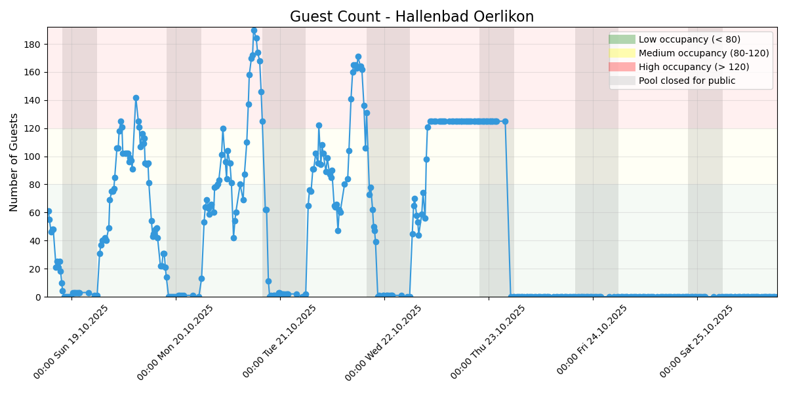
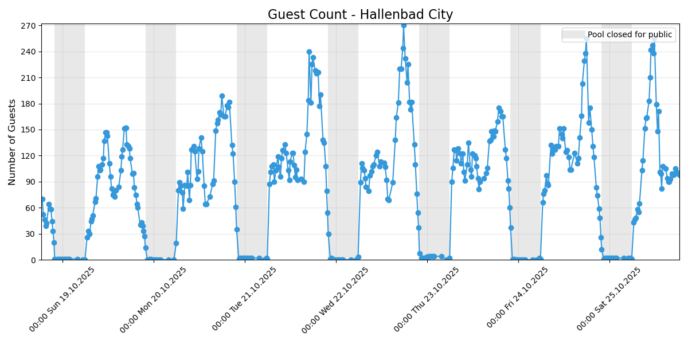

# Pool Guest Count Scraper

This project scrapes the number of current guests at two swimming pools in Zurich ([Oerlikon](https://www.stadt-zuerich.ch/de/stadtleben/sport-und-erholung/sport-und-badeanlagen/hallenbaeder/oerlikon.html), [City](https://www.stadt-zuerich.ch/de/stadtleben/sport-und-erholung/sport-und-badeanlagen/hallenbaeder/city.html)) from the [official website](https://www.stadt-zuerich.ch/de/stadtleben/sport-und-erholung/sport-und-badeanlagen/hallenbaeder.html), records the data in CSV files with timestamps and visualizes the past 7 days in the figures below.

## Pool Usage Tracking

### [Hallenbad Oerlikon](https://www.stadt-zuerich.ch/de/stadtleben/sport-und-erholung/sport-und-badeanlagen/hallenbaeder/oerlikon.html)


### [Hallenbad City](https://www.stadt-zuerich.ch/de/stadtleben/sport-und-erholung/sport-und-badeanlagen/hallenbaeder/city.html)



The charts above show the number of guests at each pool over the past 7 days. Data is updated every ~10-30 minutes.

## Features

- Scrapes the current guest count of multiple pools every ~10-30 minutes
- Saves data to separate CSV files with timestamps
- Generates visualizations of guest counts over time
- Can be run locally or via GitHub Actions


## Setup

### Local Setup with Conda

1. Clone the repository:
```bash
git clone https://github.com/mathinic/pool-scraper.git
cd pool-scraper
```

2. Create and activate a Conda environment:
```bash
# Create conda environment from environment.yml
conda env create -f environment.yml

# Activate conda environment
conda activate pool-scraper
```

3. Run the scraper:
```bash
# Run continuously with 5-minute intervals
python pool_scraper.py

# Run with custom interval (e.g., 5 minutes)
python pool_scraper.py --interval 5

# Run once and exit
python pool_scraper.py --once

# Only generate visualizations from existing data
python pool_scraper.py --visualize-only
```

### GitHub Actions Setup

The repository includes a GitHub Actions workflow that:
- Runs every ~10-30 minutes using Conda (when schedule is enabled)
- Scrapes the data for all pools
- Generates visualizations
- Commits and pushes any changes to the repository